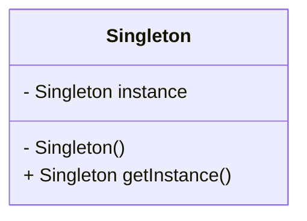

# Creational Design Pattern: Single Pattern

This pattern ensures that a class has only one instance while also providing a global access point to this instance

The constructor of this class is made private

When should you use the singleton pattern?

1. When you find yourself needing to use some global variable and that variable should always have the same value
2. If your code includes repeated expensive initialization of the same thing then you need to consider this pattern. A good example for this could be a database connection resource.
3. If you cannot have duplicate instances.
